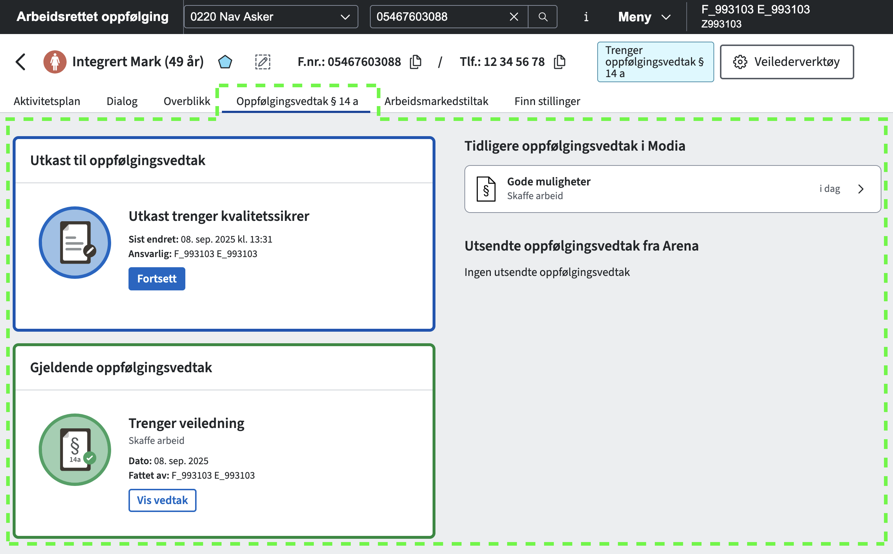

# Frontend for veilarbvedtaksstotte

Intern applikasjon som brukes av veiledere for å opprette/sende § 14 a-vedtak til bruker.

Testversjon av løsningen: [https://navikt.github.io/veilarbvedtaksstottefs](https://navikt.github.io/veilarbvedtaksstottefs)



### Installere pakker

For å kunne hente ned @navikt/arbeidssokerregisteret-utils må du legge til en `.npmrc` fil i homemappen med følgende innhold:

shell
//npm.pkg.github.com/:\_authToken=TOKEN
@navikt:registry=https://npm.pkg.github.com
[Se navikt/frontend](https://github.com/navikt/frontend?tab=readme-ov-file#installere-pakker-lokalt)

## Konfigurere git blame til å ignorere spesifikke commits

Om du ønsker er det mulig å konfigurere git blame til å ignorere spesifikke commits definert i [.git-blame-ignore-revs](.git-blame-ignore-revs) (naviger til filen for å se hvilke commits som er ignorert for dette prosjektet).
Commits definert i denne filen vil ikke dukke opp i git blame. Det anbefales å konfigurere dette per git prosjekt da git blame vil feile dersom man feks. har konfigurert dette globalt men det ikke eksisterer en
ignore-fil med riktig navn i det gitte git prosjektet du står i. Se forøvrig git sin dokumentasjon for hvordan git blame og ignoring fungerer: [https://git-scm.com/docs/git-blame#Documentation/git-blame.txt---ignore-revltrevgt](https://git-scm.com/docs/git-blame#Documentation/git-blame.txt---ignore-revltrevgt).

### Fremgangsmåte

`git config --local blame.ignoreRevsFile .git-blame-ignore-revs`

### Resette git blame dersom man har konfigurert regelen globalt ved et uhell

`git config --global --unset blame.ignoreRevsFile`

# Komme i gang
**Installere pakker**

For å kunne hente ned @navikt/arbeidssokerregisteret-utils må du legge til en `.npmrc` fil i homemappen med følgende innhold:

```shell
//npm.pkg.github.com/:_authToken=TOKEN
@navikt:registry=https://npm.pkg.github.com
```
[Se navikt/frontend](https://github.com/navikt/frontend?tab=readme-ov-file#installere-pakker-lokalt) for å se hvordan du kan generere et token på github.

## Kode generert av GitHub Copilot

Dette repoet bruker GitHub Copilot til å generere kode.

